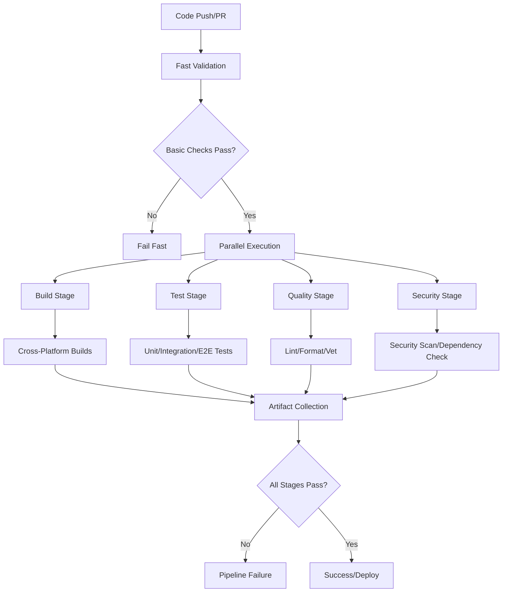

# GitHub Actions CI/CD Automation - Design Specification

## 1. Overview

This document outlines the technical design for implementing a comprehensive GitHub Actions CI/CD pipeline for the Claude Code Environment Switcher (CCE) project. The design leverages the existing Makefile infrastructure while providing robust automation, quality assurance, and deployment capabilities.

### 1.1 Design Goals

- **Leverage Existing Infrastructure**: Utilize existing Makefile targets and toolchain
- **Comprehensive Coverage**: Automate build, test, quality, and security validation
- **Performance Optimization**: Implement caching and parallelization for fast feedback
- **Reliability**: Ensure pipeline stability with proper error handling and retries
- **Cross-Platform Support**: Build and validate across all target platforms
- **Security**: Implement secure secret management and vulnerability scanning

### 1.2 Key Design Principles

- **Fail Fast**: Detect issues early in the pipeline to save resources
- **Modularity**: Design reusable workflow components
- **Observability**: Provide comprehensive logging and metrics
- **Maintainability**: Keep workflows simple and well-documented

## 2. Architecture

### 2.1 Workflow Architecture

The CI/CD system consists of multiple GitHub Actions workflows organized by purpose and trigger conditions:

```
.github/workflows/
├── ci.yml                    # Main CI pipeline (push/PR)
├── security.yml              # Security scanning and validation
├── release.yml               # Release automation (tags)
├── performance.yml           # Performance benchmarks (scheduled/main)
└── maintenance.yml           # Dependency updates and cleanup
```

### 2.2 Pipeline Flow Diagram



### 2.3 Stage Dependencies

- **Fast Validation**: Basic syntax and dependency checks (< 2 minutes)
- **Parallel Execution**: Independent stages running concurrently
- **Artifact Collection**: Consolidate results and prepare for deployment
- **Conditional Deployment**: Release automation triggered by version tags

## 3. Components and Interfaces

### 3.1 Workflow Components

#### 3.1.1 Main CI Workflow (ci.yml)

**Purpose**: Primary pipeline for all push and pull request events

**Triggers**:
- Push to any branch
- Pull request creation/update
- Workflow dispatch (manual trigger)

**Jobs**:
1. **fast-validation**: Quick syntax and dependency validation
2. **build-matrix**: Cross-platform build validation
3. **test-suite**: Comprehensive test execution
4. **quality-checks**: Code quality and linting
5. **integration**: End-to-end validation

**Job Dependencies**:
```yaml
fast-validation (independent)
├── build-matrix (depends on fast-validation)
├── test-suite (depends on fast-validation)
├── quality-checks (depends on fast-validation)
└── integration (depends on build-matrix, test-suite, quality-checks)
```

#### 3.1.2 Security Workflow (security.yml)

**Purpose**: Comprehensive security scanning and validation

**Triggers**:
- Push to main/develop branches
- Pull request to main/develop
- Scheduled weekly scans
- Workflow dispatch

**Security Components**:
- Dependency vulnerability scanning (govulncheck)
- Static security analysis (gosec)
- License compliance checking
- Secret scanning validation
- Container security (if applicable)

#### 3.1.3 Release Workflow (release.yml)

**Purpose**: Automated release creation and asset publishing

**Triggers**:
- Git tag push (pattern: v*.*.*)
- Workflow dispatch with version input

**Release Process**:
1. Validate tag format and permissions
2. Build release binaries for all platforms
3. Generate checksums and signatures
4. Create GitHub release with assets
5. Generate changelog from commits
6. Update package metadata

#### 3.1.4 Performance Workflow (performance.yml)

**Purpose**: Performance benchmarking and regression detection

**Triggers**:
- Push to main branch
- Scheduled daily runs
- Workflow dispatch

**Performance Components**:
- Go benchmark execution
- Performance regression detection
- Baseline metric updates
- Performance report generation

### 3.2 Reusable Actions

#### 3.2.1 Setup Action

**Location**: `.github/actions/setup/action.yml`

**Purpose**: Standardize Go environment setup across workflows

**Inputs**:
- `go-version`: Go version to install (default: from go.mod)
- `cache-dependency-path`: Path to go.mod for caching
- `install-tools`: Whether to install additional tools

**Responsibilities**:
- Install specified Go version
- Set up dependency caching
- Install required tools (golangci-lint, gosec, etc.)
- Configure environment variables

#### 3.2.2 Build Action

**Location**: `.github/actions/build/action.yml`

**Purpose**: Standardize build process across platforms

**Inputs**:
- `target-os`: Target operating system
- `target-arch`: Target architecture
- `output-path`: Build output directory

**Responsibilities**:
- Execute cross-platform builds
- Apply build-time variables (version, commit hash)
- Generate build artifacts
- Validate binary execution

#### 3.2.3 Test Action

**Location**: `.github/actions/test/action.yml`

**Purpose**: Comprehensive test execution with reporting

**Inputs**:
- `test-type`: Type of tests to run (unit/integration/e2e)
- `coverage-threshold`: Minimum coverage percentage
- `parallel`: Enable parallel test execution

**Responsibilities**:
- Execute specified test suites
- Generate coverage reports
- Upload test results
- Handle test retries on failure

### 3.3 External Integrations

#### 3.3.1 GitHub API Integration

**Status Checks**: Update commit status for each pipeline stage
**PR Comments**: Post detailed test results and coverage reports
**Release Management**: Automated release creation and asset uploads
**Issue Integration**: Link builds to related issues and PRs

#### 3.3.2 Tool Integration

**golangci-lint**: Code quality and style enforcement
**gosec**: Security vulnerability scanning
**govulncheck**: Dependency vulnerability analysis
**go tool cover**: Test coverage analysis and reporting

## 4. Data Models

### 4.1 Pipeline Configuration

```yaml
# Workflow Configuration Schema
name: string
on:
  push:
    branches: [string]
    paths: [string]
  pull_request:
    branches: [string]
    types: [string]
  schedule:
    - cron: string

defaults:
  run:
    shell: string

env:
  GO_VERSION: string
  CACHE_VERSION: string
  ARTIFACTS_RETENTION: number

jobs:
  job_id:
    name: string
    runs-on: string
    timeout-minutes: number
    strategy:
      matrix:
        os: [string]
        go-version: [string]
    steps:
      - name: string
        uses: string
        with:
          key: value
```

### 4.2 Build Matrix Configuration

```yaml
# Multi-platform Build Matrix
strategy:
  fail-fast: false
  matrix:
    include:
      - os: ubuntu-latest
        goos: linux
        goarch: amd64
        artifact-name: cce-linux-amd64
      - os: ubuntu-latest
        goos: linux
        goarch: arm64
        artifact-name: cce-linux-arm64
      - os: macos-latest
        goos: darwin
        goarch: amd64
        artifact-name: cce-darwin-amd64
      - os: macos-latest
        goos: darwin
        goarch: arm64
        artifact-name: cce-darwin-arm64
      - os: windows-latest
        goos: windows
        goarch: amd64
        artifact-name: cce-windows-amd64.exe
```

### 4.3 Test Configuration Schema

```yaml
# Test Suite Configuration
test-suites:
  unit:
    path: "./..."
    coverage: true
    race: true
    timeout: "10m"
  integration:
    path: "./test/integration/..."
    parallel: false
    timeout: "15m"
  security:
    path: "./test/security/..."
    timeout: "5m"
  performance:
    path: "./test/performance/..."
    benchmarks: true
    timeout: "20m"
```

### 4.4 Artifact Schema

```yaml
# Build Artifacts Structure
artifacts:
  binaries:
    name: "cce-binaries"
    path: "dist/"
    retention-days: 90
  test-results:
    name: "test-results"
    path: "test-results/"
    retention-days: 30
  coverage:
    name: "coverage-reports"
    path: "coverage.html"
    retention-days: 30
```

## 5. Error Handling

### 5.1 Error Classification

**Build Errors**:
- Compilation failures
- Dependency resolution issues
- Platform-specific build problems

**Test Errors**:
- Unit test failures
- Integration test failures
- Coverage threshold violations
- Test timeout issues

**Quality Errors**:
- Linting violations
- Format inconsistencies
- Security vulnerability findings
- Code quality threshold failures

**Infrastructure Errors**:
- GitHub Actions service issues
- Network connectivity problems
- Tool installation failures
- Resource exhaustion

### 5.2 Error Recovery Strategies

#### 5.2.1 Retry Logic

**Transient Failures**: Automatic retry with exponential backoff
- Network timeouts: 3 retries with 30s, 60s, 120s delays
- Tool installation failures: 2 retries with 10s, 30s delays
- Test flakiness: 2 retries with immediate retry

**Retry Configuration**:
```yaml
# Retry Strategy
retry:
  max-attempts: 3
  retry-on: 
    - error
    - timeout
  retry-wait-seconds: 30
  exponential-base: 2
```

#### 5.2.2 Fallback Mechanisms

**Tool Failures**: Graceful degradation when optional tools fail
**Platform Failures**: Continue building other platforms when one fails
**Test Failures**: Isolate failing tests to prevent cascade failures

#### 5.2.3 Notification Strategy

**Immediate Notifications**:
- Build failures on main branch
- Security vulnerability discoveries
- Infrastructure outages

**Escalation Path**:
1. GitHub commit status updates
2. Pull request comments
3. Issue creation for persistent failures
4. Team notifications for critical failures

### 5.3 Debugging Support

**Log Collection**: Comprehensive logging with structured output
**Artifact Preservation**: Save debug artifacts for failed builds
**Environment Recreation**: Provide steps to reproduce failures locally
**Diagnostic Information**: Include system state and configuration in error reports

## 6. Testing Strategy

### 6.1 Pipeline Testing

#### 6.1.1 Workflow Validation

**Syntax Testing**: Use `act` tool for local workflow validation
**Schema Validation**: Validate workflow YAML against GitHub Actions schema
**Dry Run Testing**: Test workflow changes in feature branches

**Testing Commands**:
```bash
# Local workflow testing with act
act -n                           # Dry run all workflows
act pull_request                 # Test PR workflow
act push -e event.json          # Test with custom event

# Workflow validation
yamllint .github/workflows/      # YAML syntax validation
actionlint .github/workflows/    # GitHub Actions specific linting
```

#### 6.1.2 Integration Testing

**Branch Protection Testing**: Verify status checks prevent merging
**Matrix Testing**: Validate all platform combinations
**Secret Handling**: Test secret masking and injection
**Artifact Testing**: Verify artifact upload and download

### 6.2 Quality Assurance

#### 6.2.1 Workflow Code Quality

**Standardization**: Use consistent naming and structure
**Documentation**: Comprehensive inline documentation
**Version Pinning**: Pin action versions for reproducibility
**Security**: Regular security scanning of workflow dependencies

#### 6.2.2 Performance Testing

**Build Time Monitoring**: Track pipeline execution times
**Resource Usage**: Monitor CPU, memory, and storage usage
**Caching Effectiveness**: Measure cache hit rates and performance impact
**Parallel Execution**: Validate parallel job efficiency

### 6.3 Test Data Management

#### 6.3.1 Test Environment Isolation

**Temporary Directories**: Use GitHub Actions temporary file system
**Environment Variables**: Isolate test configuration
**Network Isolation**: Mock external dependencies where possible
**State Cleanup**: Ensure tests don't affect each other

#### 6.3.2 Test Data Generation

**Mock Services**: Generate test configurations and responses
**Fixture Management**: Maintain test data consistency
**Edge Case Coverage**: Include boundary conditions and error scenarios

## 7. Security Considerations

### 7.1 Secret Management

#### 7.1.1 Secret Classification

**Repository Secrets**: API keys, tokens for external services
**Environment Secrets**: Environment-specific configuration
**Organization Secrets**: Shared secrets across repositories

**Secret Lifecycle**:
- Creation: Secure generation and initial storage
- Rotation: Regular rotation schedule (90 days)
- Revocation: Immediate revocation for compromised secrets
- Audit: Regular access pattern auditing

#### 7.1.2 Secret Access Control

**Principle of Least Privilege**: Limit secret access to required workflows
**Environment Restrictions**: Restrict secrets to specific environments
**Branch Protection**: Limit secret access from protected branches only
**Audit Logging**: Log all secret access attempts

### 7.2 Dependency Security

#### 7.2.1 Supply Chain Security

**Action Pinning**: Pin all external actions to specific commit SHAs
**Dependency Scanning**: Regular vulnerability scanning of dependencies
**License Compliance**: Automated license compatibility checking
**Provenance Verification**: Verify action and dependency authenticity

**Security Configuration**:
```yaml
# Secure action usage
- uses: actions/checkout@8ade135a41bc03ea155e62e844d188df1ea18608  # v4.1.0
- uses: actions/setup-go@93397bea11091df50f3d7e59dc26a7711a8bcfbe    # v4.1.0
```

#### 7.2.2 Code Security

**Static Analysis**: Automated security vulnerability scanning
**Secrets Scanning**: Prevent accidental secret commit
**Code Injection Prevention**: Sanitize user inputs in workflows
**Privilege Escalation**: Prevent unauthorized permission elevation

### 7.3 Access Control

#### 7.3.1 Workflow Permissions

**Minimal Permissions**: Use minimal required permissions for each job
**Token Scoping**: Limit GitHub token permissions
**Read-Only Default**: Default to read-only permissions unless write required
**Permission Auditing**: Regular permission requirement reviews

**Permission Configuration**:
```yaml
permissions:
  contents: read          # Read repository contents
  actions: read          # Read workflow run information
  checks: write          # Write check run results
  pull-requests: write   # Comment on PRs
  statuses: write        # Update commit statuses
```

#### 7.3.2 Branch Protection

**Required Status Checks**: Mandate CI success before merging
**Dismiss Stale Reviews**: Require fresh approvals after changes
**Restrict Pushes**: Limit direct pushes to protected branches
**Admin Enforcement**: Apply rules to administrators

## 8. Performance Optimization

### 8.1 Caching Strategy

#### 8.1.1 Build Caching

**Go Module Cache**: Cache downloaded dependencies
**Build Cache**: Cache compiled artifacts
**Tool Cache**: Cache installed tools and utilities

**Cache Configuration**:
```yaml
# Go module caching
- uses: actions/cache@v3
  with:
    path: |
      ~/.cache/go-build
      ~/go/pkg/mod
    key: ${{ runner.os }}-go-${{ hashFiles('**/go.sum') }}
    restore-keys: |
      ${{ runner.os }}-go-
```

#### 8.1.2 Cache Optimization

**Cache Layering**: Implement hierarchical caching strategy
**Cache Warming**: Pre-populate caches for common scenarios
**Cache Invalidation**: Proper cache invalidation on dependency changes
**Cache Monitoring**: Monitor cache hit rates and effectiveness

### 8.2 Parallel Execution

#### 8.2.1 Job Parallelization

**Independent Jobs**: Run independent jobs concurrently
**Matrix Builds**: Parallel platform builds
**Test Parallelization**: Concurrent test suite execution
**Stage Pipelining**: Overlap dependent stages where possible

#### 8.2.2 Resource Optimization

**Runner Selection**: Choose appropriate runner types for each job
**Timeout Management**: Set appropriate timeouts for each stage
**Resource Monitoring**: Track resource usage and optimization opportunities
**Cost Optimization**: Balance performance with GitHub Actions cost

### 8.3 Optimization Monitoring

#### 8.3.1 Performance Metrics

**Build Time Tracking**: Monitor total and stage-specific build times
**Resource Usage**: Track CPU, memory, and storage consumption
**Cache Effectiveness**: Measure cache hit rates and performance gains
**Failure Analysis**: Analyze failure patterns and optimization opportunities

#### 8.3.2 Continuous Improvement

**Baseline Establishment**: Establish performance baselines
**Trend Analysis**: Monitor performance trends over time
**Optimization Identification**: Identify bottlenecks and improvement opportunities
**A/B Testing**: Test optimization changes with experimental workflows