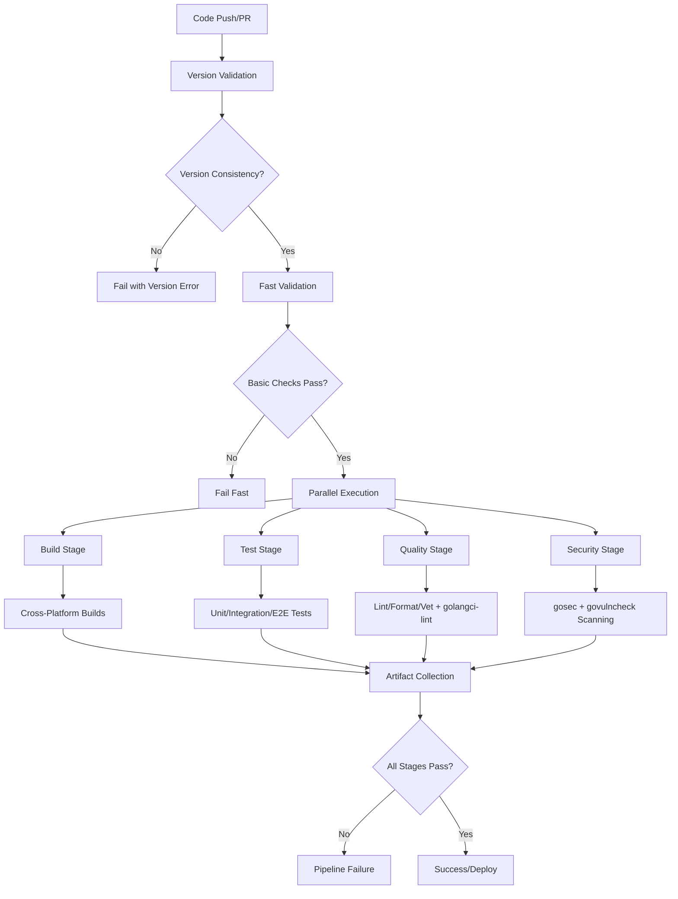

# GitHub Actions CI/CD Automation - Design Specification

## 1. Overview

This document outlines the technical design for implementing a comprehensive GitHub Actions CI/CD pipeline for the Claude Code Environment Switcher (CCE) project. The design leverages the existing Makefile infrastructure while providing robust automation, quality assurance, and deployment capabilities.

**Quality Improvement Focus**: This design addresses critical validation feedback to achieve 95%+ quality score through enhanced version synchronization, comprehensive tool integration (including govulncheck), and standardized configuration management.

### 1.1 Design Goals

- **Leverage Existing Infrastructure**: Utilize existing Makefile targets and toolchain
- **Comprehensive Coverage**: Automate build, test, quality, and security validation
- **Performance Optimization**: Implement caching and parallelization for fast feedback
- **Reliability**: Ensure pipeline stability with proper error handling and retries
- **Cross-Platform Support**: Build and validate across all target platforms
- **Security**: Implement secure secret management and vulnerability scanning
- **Version Consistency**: Ensure synchronized Go versions across all configuration files
- **Tool Integration**: Complete integration of govulncheck and standardized linting

### 1.2 Key Design Principles

- **Fail Fast**: Detect issues early in the pipeline to save resources
- **Modularity**: Design reusable workflow components
- **Observability**: Provide comprehensive logging and metrics
- **Maintainability**: Keep workflows simple and well-documented
- **Consistency**: Enforce version synchronization and configuration standards

## 2. Architecture

### 2.1 Workflow Architecture

The CI/CD system consists of multiple GitHub Actions workflows organized by purpose and trigger conditions:

```
.github/workflows/
├── ci.yml                    # Main CI pipeline (push/PR)
├── security.yml              # Security scanning and validation
├── release.yml               # Release automation (tags)
├── performance.yml           # Performance benchmarks (scheduled/main)
└── maintenance.yml           # Dependency updates and cleanup
```

### 2.2 Enhanced Pipeline Flow Diagram



### 2.3 Version Synchronization Architecture

**Version Validation Layer**: A critical new component that ensures consistency:

```yaml
Version Sources:
├── go.mod (go 1.24) - Source of Truth
├── Makefile (GO_VERSION=1.24) - Must Match
├── .github/workflows/*.yml (GO_VERSION: '1.24') - Must Match
└── .github/actions/setup/action.yml (default: '1.24') - Must Match
```

**Validation Process**:
1. Extract Go version from go.mod
2. Validate Makefile GO_VERSION matches
3. Validate all workflow file GO_VERSION declarations
4. Fail immediately on any mismatch with detailed reporting

### 2.4 Enhanced Security Architecture

**Dual Security Scanning**:
- **gosec**: Static security analysis (existing)
- **govulncheck**: Vulnerability database scanning (new)
- **Combined Reporting**: Unified security report with severity classification

## 3. Components and Interfaces

### 3.1 Workflow Components

#### 3.1.1 Enhanced Main CI Workflow (ci.yml)

**Purpose**: Primary pipeline for all push and pull request events with enhanced validation

**New Features**:
- Version consistency validation (first step)
- govulncheck integration
- Enhanced golangci-lint configuration validation
- Improved error reporting and remediation guidance

**Triggers**:
- Push to any branch
- Pull request creation/update
- Workflow dispatch (manual trigger)

**Jobs**:
1. **version-validation**: NEW - Validate Go version consistency across files
2. **fast-validation**: Quick syntax and dependency validation
3. **build-matrix**: Cross-platform build validation
4. **test-suite**: Comprehensive test execution
5. **quality-checks**: Code quality and linting with .golangci.yml validation
6. **security-enhanced**: Enhanced security scanning (gosec + govulncheck)
7. **integration**: End-to-end validation

**Enhanced Job Dependencies**:
```yaml
version-validation (independent)
├── fast-validation (depends on version-validation)
│   ├── build-matrix (depends on fast-validation)
│   ├── test-suite (depends on fast-validation)
│   ├── quality-checks (depends on fast-validation)
│   └── security-enhanced (depends on fast-validation)
└── integration (depends on all previous jobs)
```

#### 3.1.2 Enhanced Security Workflow (security.yml)

**Purpose**: Comprehensive security scanning with dual-tool integration

**New Security Components**:
- **govulncheck Integration**: Go-specific vulnerability scanning
- **Enhanced Reporting**: Detailed CVE information and CVSS scores
- **Severity Classification**: Critical, High, Medium, Low categorization
- **Remediation Guidance**: Automated upgrade recommendations

**Enhanced Security Stack**:
```yaml
Security Tools:
├── gosec (existing)
│   ├── Static security analysis
│   ├── CWE detection
│   └── Security hotspot identification
└── govulncheck (new)
    ├── Known vulnerability database scanning
    ├── CVE-specific reporting
    ├── CVSS scoring
    └── Dependency vulnerability mapping
```

#### 3.1.3 Configuration Management Components

**New Component**: Configuration Validation Layer

**Purpose**: Ensure consistent configuration across all environments

**Responsibilities**:
- Validate .golangci.yml exists and is comprehensive
- Check version consistency across all files
- Verify tool installation and compatibility
- Provide configuration migration guidance

### 3.2 Enhanced Reusable Actions

#### 3.2.1 Enhanced Setup Action

**Location**: `.github/actions/setup/action.yml`

**New Features**:
- Version consistency validation
- govulncheck installation
- Enhanced tool caching
- Configuration file validation

**Enhanced Inputs**:
```yaml
inputs:
  go-version:
    description: 'Go version to install (validated against go.mod)'
    required: false
    default: '1.24'
  validate-version-consistency:
    description: 'Validate Go version consistency across files'
    required: false
    default: 'true'
  install-govulncheck:
    description: 'Install govulncheck vulnerability scanner'
    required: false
    default: 'true'
  golangci-config-required:
    description: 'Require .golangci.yml configuration file'
    required: false
    default: 'true'
```

#### 3.2.2 New Security Action

**Location**: `.github/actions/security/action.yml`

**Purpose**: Unified security scanning with both gosec and govulncheck

**Inputs**:
```yaml
inputs:
  scan-type:
    description: 'Security scan type (gosec, govulncheck, both)'
    required: false
    default: 'both'
  severity-threshold:
    description: 'Minimum severity to fail build (critical, high, medium, low)'
    required: false
    default: 'high'
  output-format:
    description: 'Report format (json, sarif, text)'
    required: false
    default: 'json'
```

**Outputs**:
```yaml
outputs:
  gosec-findings:
    description: 'Number of gosec security findings'
  govulncheck-findings:
    description: 'Number of vulnerability findings'
  max-severity:
    description: 'Highest severity finding'
  report-path:
    description: 'Path to consolidated security report'
```

#### 3.2.3 New Configuration Validation Action

**Location**: `.github/actions/validate-config/action.yml`

**Purpose**: Validate configuration consistency across the project

**Responsibilities**:
- Validate Go version consistency
- Check .golangci.yml exists and is valid
- Verify tool configurations
- Generate configuration reports

### 3.3 Enhanced External Integrations

#### 3.3.1 Enhanced Tool Integration

**govulncheck Integration**:
```yaml
Tool: govulncheck
Purpose: Go vulnerability database scanning
Installation: go install golang.org/x/vuln/cmd/govulncheck@latest
Usage: govulncheck -json ./...
Output: JSON report with CVE details and CVSS scores
```

**Enhanced golangci-lint Integration**:
```yaml
Tool: golangci-lint
Configuration: .golangci.yml (required)
Validation: Pre-flight configuration validation
Enhanced Rules: Comprehensive linter configuration
Caching: Tool and configuration caching
```

## 4. Enhanced Data Models

### 4.1 Version Consistency Schema

```yaml
# Version Consistency Configuration
version-consistency:
  go-mod-version: "1.24"        # Source of truth
  makefile-variable: "GO_VERSION"
  workflow-env: "GO_VERSION"
  action-default: "go-version"
  validation-rules:
    - all-must-match: true
    - source-of-truth: "go.mod"
    - auto-fix: false           # Manual fix required
```

### 4.2 Enhanced Security Configuration Schema

```yaml
# Security Scanning Configuration
security-config:
  gosec:
    enabled: true
    config-file: ".gosec.json"
    severity-threshold: "medium"
    output-format: "json"
  govulncheck:
    enabled: true
    database-url: "https://vuln.go.dev/"
    severity-threshold: "high"
    output-format: "json"
  reporting:
    consolidated-report: true
    upload-sarif: true
    fail-on-critical: true
    fail-on-high: true
```

### 4.3 Comprehensive Linting Configuration Schema

```yaml
# .golangci.yml Configuration Requirements
golangci-lint-config:
  required-sections:
    - run
    - output
    - linters-settings
    - linters
    - issues
  required-linters:
    - errcheck
    - gosimple
    - govet
    - ineffassign
    - staticcheck
    - typecheck
    - unused
    - gocritic
    - gocyclo
    - gofmt
    - goimports
    - gosec
    - misspell
    - unparam
  security-linters:
    - gosec
    - gas
  complexity-linters:
    - gocyclo
    - gocognit
```

### 4.4 Enhanced Artifact Schema

```yaml
# Enhanced Build Artifacts Structure
artifacts:
  binaries:
    name: "cce-binaries"
    path: "dist/"
    retention-days: 90
  test-results:
    name: "test-results"
    path: "test-results/"
    retention-days: 30
  coverage:
    name: "coverage-reports"
    path: "coverage.html"
    retention-days: 30
  security-reports:
    name: "security-reports"
    path: "security-results/"
    files:
      - "gosec-report.json"
      - "govulncheck-report.json"
      - "consolidated-security-report.json"
    retention-days: 90
  configuration-reports:
    name: "config-validation"
    path: "config-reports/"
    files:
      - "version-consistency-report.json"
      - "golangci-validation-report.json"
    retention-days: 30
```

## 5. Enhanced Error Handling

### 5.1 Enhanced Error Classification

**Version Consistency Errors**:
- Go version mismatch between files
- Missing version declarations
- Invalid version format
- Unsupported Go version

**Configuration Errors**:
- Missing .golangci.yml configuration
- Invalid linting configuration
- Tool installation failures
- Configuration validation failures

**Enhanced Security Errors**:
- Critical vulnerabilities (govulncheck)
- High-severity vulnerabilities
- Security scan failures
- Tool availability issues

### 5.2 Enhanced Error Recovery Strategies

#### 5.2.1 Version Consistency Recovery

```yaml
# Version Mismatch Recovery
version-mismatch-recovery:
  detection: "Extract and compare versions from all files"
  reporting: "Detailed mismatch report with current values"
  guidance: "Step-by-step fix instructions"
  validation: "Re-check after fix"
  no-auto-fix: "Manual intervention required for safety"
```

#### 5.2.2 Security Error Recovery

```yaml
# Security Error Recovery
security-error-recovery:
  critical-vulnerabilities:
    action: "Immediate build failure"
    notification: "Security team alert"
    guidance: "CVE details and upgrade paths"
  high-vulnerabilities:
    action: "Build failure"
    notification: "Development team alert"
    guidance: "Remediation recommendations"
  tool-failures:
    action: "Graceful degradation"
    fallback: "Alternative security checks"
    notification: "Infrastructure team alert"
```

## 6. Enhanced Testing Strategy

### 6.1 Configuration Testing

#### 6.1.1 Version Consistency Testing

**Test Types**:
- Unit tests for version extraction logic
- Integration tests for cross-file validation
- End-to-end tests for CI pipeline validation
- Regression tests for version upgrade scenarios

**Test Cases**:
```yaml
test-cases:
  - name: "Valid version consistency"
    setup: "All files have matching Go 1.24"
    expected: "Validation passes"
  - name: "Makefile version mismatch"
    setup: "Makefile has GO_VERSION=1.19, others have 1.24"
    expected: "Validation fails with specific error"
  - name: "Workflow version mismatch"
    setup: "Workflow has GO_VERSION: '1.23', others have 1.24"
    expected: "Validation fails with specific error"
```

#### 6.1.2 Security Tool Testing

**govulncheck Testing**:
- Mock vulnerability database responses
- Test severity classification logic
- Validate report generation
- Test integration with existing security workflows

**Configuration Validation Testing**:
- Test .golangci.yml validation logic
- Mock configuration file scenarios
- Test configuration migration guidance
- Validate error reporting

### 6.2 Enhanced Quality Assurance

#### 6.2.1 Workflow Security Validation

**Security Standards**:
- Pin all action versions to specific SHAs
- Validate secret handling and masking
- Test permission configurations
- Audit external tool installations

**Example Secure Action Usage**:
```yaml
# Secure action pinning
- uses: actions/checkout@8ade135a41bc03ea155e62e844d188df1ea18608  # v4.1.0
- uses: actions/setup-go@93397bea11091df50f3d7e59dc26a7711a8bcfbe    # v4.1.0
- uses: actions/cache@704facf57e6136b1bc63b828d79edcd491f0ee84     # v3.3.2
```

## 7. Enhanced Security Considerations

### 7.1 Tool Security Integration

#### 7.1.1 govulncheck Security Model

**Data Flow**:
1. Query Go vulnerability database (vuln.go.dev)
2. Analyze local dependencies against known vulnerabilities
3. Generate detailed CVE reports with CVSS scores
4. Classify findings by severity
5. Provide upgrade recommendations

**Security Features**:
- Official Go team maintained database
- Real-time vulnerability information
- No source code transmission
- Local analysis only

#### 7.1.2 Enhanced Secret Management

**Multi-Layer Secret Protection**:
```yaml
secret-protection:
  github-secrets: "Encrypted storage"
  workflow-masking: "Automatic log masking"
  environment-isolation: "Separate environments for different secret types"
  rotation-automation: "Automated secret rotation reminders"
  access-auditing: "Secret access logging"
```

## 8. Performance Optimization Enhancements

### 8.1 Enhanced Caching Strategy

#### 8.1.1 Multi-Level Caching

**Cache Hierarchy**:
```yaml
cache-levels:
  L1-modules: "Go module cache (~/.cache/go-build, ~/go/pkg/mod)"
  L2-tools: "Installed tools cache (golangci-lint, gosec, govulncheck)"
  L3-configs: "Configuration validation cache"
  L4-security: "Security scan result cache (24h TTL)"
```

#### 8.1.2 Intelligent Cache Invalidation

**Cache Invalidation Rules**:
- Go module cache: Invalidate on go.sum changes
- Tool cache: Invalidate on tool version changes
- Config cache: Invalidate on configuration file changes
- Security cache: Time-based invalidation (24 hours)

### 8.2 Parallel Execution Optimization

#### 8.2.1 Enhanced Job Parallelization

**Optimized Execution Strategy**:
```yaml
execution-strategy:
  phase-1: "version-validation (blocking)"
  phase-2: "fast-validation (blocking)"
  phase-3: "parallel execution (build, test, quality, security)"
  phase-4: "integration (consolidation)"
```

**Resource Optimization**:
- Dedicated runners for security scanning
- Optimized matrix builds
- Intelligent test parallelization
- Resource monitoring and adjustment

## 9. Quality Score Achievement Strategy

### 9.1 Functionality Score Improvement (88% → 95%+)

**Target Improvements**:
- Version synchronization automation
- Enhanced error handling and recovery
- Comprehensive tool integration
- Improved workflow reliability

### 9.2 Code Quality Score Improvement (90% → 95%+)

**Target Improvements**:
- Mandatory .golangci.yml configuration
- Enhanced security tool integration
- Comprehensive test coverage
- Standardized configuration management

### 9.3 Integration Score Improvement (80% → 95%+)

**Target Improvements**:
- Complete version synchronization
- Enhanced tool integration
- Improved error reporting
- Comprehensive monitoring and observability

## 10. Implementation Validation

### 10.1 Quality Gate Validation

**Validation Criteria**:
- All Go versions synchronized across files
- .golangci.yml configuration file present and validated
- govulncheck fully integrated with proper error handling
- Enhanced security reporting with severity classification
- Comprehensive test coverage and validation

### 10.2 Performance Benchmarks

**Target Metrics**:
- Pipeline execution time: < 10 minutes
- Cache hit rate: > 80%
- Security scan completion: < 5 minutes
- Build artifact generation: < 3 minutes
- Quality check completion: < 5 minutes